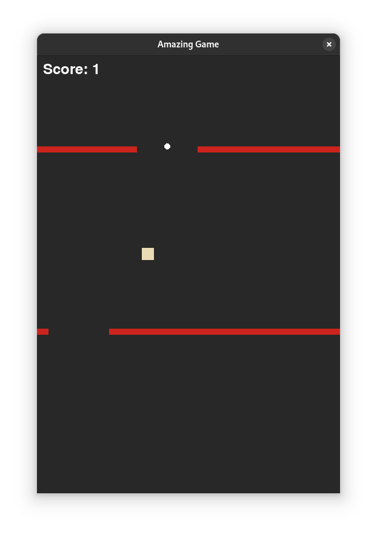
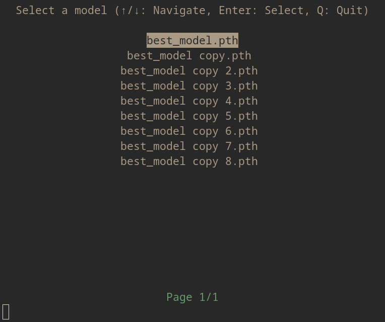

# Amazing DQN Game

This project implements a Deep Q-Network (DQN) to play a custom 2D obstacle avoidance game. The game environment is built using Pygame and Gym, and the agent learns to navigate a cube through gaps in obstacles to maximize its score.

## Game Environment

### States
The observation space consists of **4 continuous values** representing the game state:
1. **Cube Horizontal Speed (`xSpeed`)**:
   - The current horizontal velocity of the cube.
   - Range: `[-70, 70]` (negative = left, positive = right).

2. **Cube X-Position (`x`)**:
   - The current horizontal position of the cube.
   - Range: `[0, SCREEN_WIDTH]` (pixels).

3. **Current Gap Center X-Position (`gap_center_x`)**:
   - The horizontal center of the next gap the cube needs to pass through.
   - Range: `[0, SCREEN_WIDTH]` (pixels).

4. **Vertical Distance to Current Gap (`distance_to_gap`)**:
   - The vertical distance between the cube and the next gap.
   - Range: `[0, SCREEN_HEIGHT]` (pixels).

### Actions
The agent can take **3 discrete actions**:
1. **Action 0**: Move left and jump.
   - Applies a horizontal velocity of `-70` and a vertical jump force.

2. **Action 1**: Move right and jump.
   - Applies a horizontal velocity of `+70` and a vertical jump force.

3. **Action 2**: Do nothing.
   - Maintains the current horizontal velocity and lets gravity act on the cube.

### Rewards
The reward structure is designed to encourage the agent to pass through gaps while avoiding collisions:
1. **Positive Rewards**:
   - **+10 per passed gap** (scaled with the score multiplier).
   - Example: Passing 5 gaps = `10 * 5 = 50` reward.

2. **Negative Rewards**:
   - **-20** for touching the left or right edge of the screen.
   - **-60** for falling off the bottom of the screen.
   - **-10** for colliding with an obstacle.

3. **Termination**:
   - The episode ends if the cube:
     - Falls off the screen.
     - Collides with an obstacle.

---

## Installation

To install the required dependencies, run:
```bash
pip install -r requirements.txt
```

## Usage

### Training the DQN Agent
To train the agent, run:
```bash
python train.py --render --episodes 2000
```
- `--render`: Enables rendering the game during training.
- `--episodes`: Number of training episodes.

### Testing the Trained Agent
To test the trained agent, run:
```bash
python replay.py
```
This will load the best saved model and let you watch the agent play.

---

### Screenshots
Add your gameplay screenshots or GIFs here:
1. **Gameplay Screenshot**:
   

2. **Replay.py Menu**:
   

---
